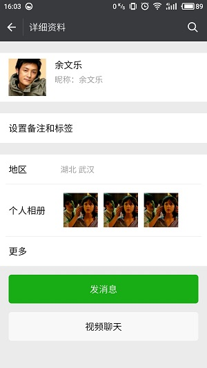
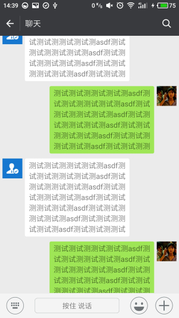
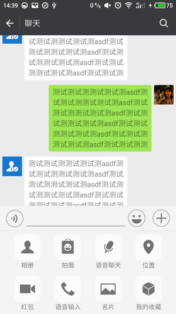
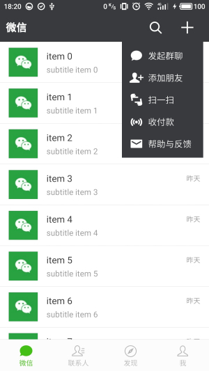
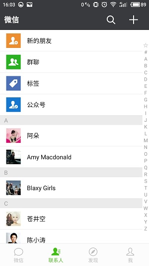
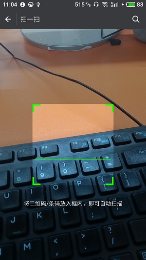
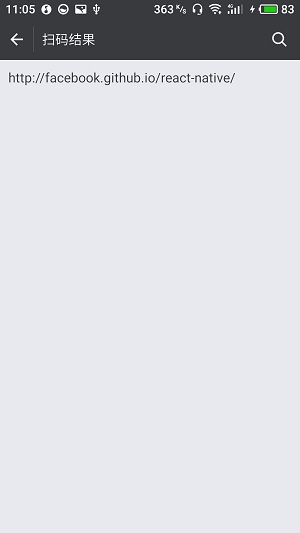
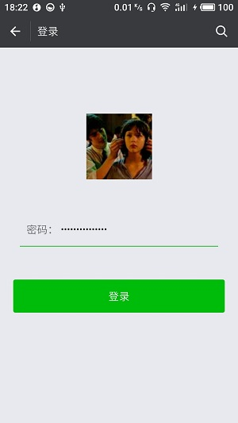

# RNWeChat
* 使用ReactNative开发的仿微信客户端，欢迎大家给个star或fork，谢谢~~
* 如果在项目构建过程中有任何问题，欢迎提issue，我有空一定帮忙解答~~

# 运行方法
1. 在项目根目录下执行npm install
2. 项目中的导航组件使用的ReactNavigation，所以还需要执行npm install --save react-navigation
3. 二维码扫描组件使用了开源项目react-native-camera和AC-QRCode-RN，请按这两个项目的文档添加至项目中，地址为：
  * https://github.com/lwansbrough/react-native-camera
  * https://github.com/MarnoDev/AC-QRCode-RN/blob/master/README_CN.md
4. 上面几步执行结束后，再执行react-native run-android即可
5. apk目录下有RNWeChat-release.apk文件，可直接安装查看效果

# 注意
打release包时请使用自己的签名文件和签名配置，请注意android/app/build.gradle文件中的
```
signingConfigs {
    release {
        storeFile file(MYAPP_RELEASE_STORE_FILE)
        storePassword MYAPP_RELEASE_STORE_PASSWORD
        keyAlias MYAPP_RELEASE_KEY_ALIAS
        keyPassword MYAPP_RELEASE_KEY_PASSWORD
    }
}
```

# 更新
* 2017-6-8 修改联系人数据从服务端获取，包括联系人姓名、头像等，其他部分数据暂时为测试数据
* 2017-8-11 加入扫一扫功能，加入登录注册页面，登录和注册的功能后面实现，加入购物页面和卡包页面

# 截图












